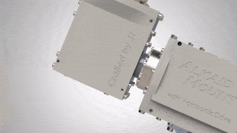

# Alkaid Mount - DIY Equatorial Mount with HarmonicDrive

Built by JZ.

For my build log, checkout [this page on my website](https://alanz.info/posts/2022/07/diy-mount/).

The following YouTube video documents all the processes with no explaination:

The same video can also be found on [bilibili](https://www.bilibili.com/video/BV1SR4y1X7bt/?share_source=copy_web&vd_source=4d6f936f693563e28752aadac9dd326f).

## Introduction
AlkaidMount is a DIY aluminum HarmonicDrive German style equatorial mount with a ~25lbs unbalanced or >70lbs balanced load capacity, with a self weight of only ~16lbs.
Each axis consists of a 100:1 HarmonicDrive gearbox, followed by a 27:1 planetary gearbox, driven by a Nema17 stepper motor.

Weight capacity is calculated with gearbox load limits as well as rigid body simulation.
Note that I have not yet done any torture tests, so those numbers are all theoratical. 
I've only tested it on the two scopes I own - an unbalanced Williams Optics GT71 setup (~15lbs) and balanced a Meade LX200 8" SCT setup (~25lbs not including the counterweights).
Both setups worked beautifully.

This repo contains ALL the design files (CAD, manufacture drawings, PCB files, software) to make the AlkaidMount.
I made this repo public to inspire other ideas.
Due to the difficulty in sourcing the exact same model of the two HarmonicDrive's (unless you buy new:), replicating the exact same mount would be hard. 
However modifying this design to suite other HD models shouldn't be too hard.

## BOM - Hardware
-----------
| Name | Quantity | Drawings | Datasheet |
| -------- | -------- | -------- | -------- |
| Harmonic Drive CSF-17-100-2UH-LW | 2 | [Drawings](https://www.harmonicdrive.net/_hd/content/caddownloads/dxf/csf-2uh_gearheads/csf-17-xx-2uh.pdf) | [Datasheet](https://www.harmonicdrive.net/products/gear-units/gear-units/csf-2uh/csf-17-100-2uh) |
| Nema 17 with 27:1 Planetary Gearbox | 2 | [Drawings](https://www.omc-stepperonline.com/download/17HS19-1684S-PG27.pdf) | [Datasheet](https://www.omc-stepperonline.com/nema-17-stepper-motor-bipolar-l-48mm-w-gear-ratio-27-1-planetary-gearbox-17hs19-1684s-pg27) |
| 1/8" Aluminum plate | 12"x12" minimum | - | - |
| 1/4" Aluminum plate | - | - | - |
| M4x8 | many :) | - | - |
| M3x8 | not that many :] | - | - |
| M5x8 | a few :{ | - | - |

## BOM - Electronics
-----------
| Name | Quantity | Drawings | Datasheet |
| -------- | -------- | -------- | -------- |
| Teensy 4.0 | 1 | - | - |
| ESP-32 (for wifi control) | 1 | - | - |

For parts on the PCB, see [PCB/parts.txt](PCB/parts.txt).

## Manufacturing guide

Most parts were made with 2D waterjetting, with not too much post-processing (tab removal, tapping if needed).
Some parts have holes on the side, so some milling was involved.